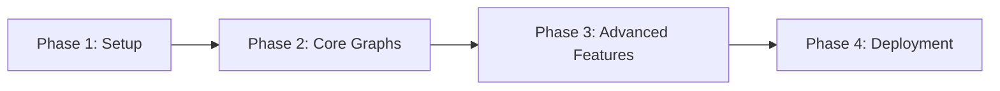

# Semantic Tree Visualization - Complete Implementation Plan

## Project Overview

This document provides a comprehensive implementation plan for building a semantic tree visualization dashboard using AntV G6, Next.js, and PostgreSQL. The application will visualize conversation intelligence data from the NLP1 database schema, displaying message relationships and semantic connections in an interactive graph format.

## Architecture Summary

### Technology Stack
- **Frontend**: Next.js 15.4.1 with React 19, TypeScript
- **Visualization**: AntV G6 5.0.49
- **Styling**: Tailwind CSS 4
- **State Management**: Zustand
- **Database**: PostgreSQL with pgvector extension
- **Deployment**: Vercel

### Database Integration
- **Host**: 194.110.175.36:5000
- **Database**: conversation-intelligence
- **Schema**: NLP1 with vector embeddings and semantic relationships
- **Tables**: channels, messages (contextual/noise), message_edges

### Key Features
1. **Hierarchical Tree Visualization** - Primary layout showing conversation structure
2. **Alternative Layouts** - Force-directed and radial views
3. **Timebar Component** - Temporal replay of conversations
4. **Advanced Filtering** - By author, time, content, semantic similarity
5. **Semantic Exploration** - Path finding and cluster detection
6. **Export & Sharing** - Multiple format support and URL sharing

## Implementation Phases

### Phase 1: Project Setup & Foundation (Week 1-2)
**Files**: [implementation-plan-phase1-setup.md](./implementation-plan-phase1-setup.md)

**Deliverables**:
- ✅ Clean project structure with organized directories
- ✅ Zustand global state management system
- ✅ Database integration with type-safe interfaces
- ✅ Basic UI component library
- ✅ Channel selection landing page
- ✅ Environment configuration for development

**Key Components**:
```
app/
├── stores/graphStore.ts          # Global state management
├── types/index.ts                # Database schema types
├── lib/database.ts               # Database query functions
├── utils/dataTransform.ts        # Data transformation utilities
├── components/ui/                # Reusable UI components
└── components/panels/            # Layout components
```

### Phase 2: Core Graph Visualization (Week 3-4)
**Files**: [implementation-plan-phase2-core-graphs.md](./implementation-plan-phase2-core-graphs.md)

**Deliverables**:
- ✅ G6 React wrapper with lifecycle management
- ✅ Custom message and channel nodes with design-compliant styling
- ✅ Custom reply and semantic edges with visual differentiation
- ✅ Hierarchical tree layout implementation
- ✅ Basic interactions (select, hover, zoom, pan)
- ✅ Data processing pipeline from database to G6 format
- ✅ Dashboard integration with working visualization

**Key Components**:
```
app/components/graphs/
├── G6Graph.tsx                   # React-G6 wrapper
├── nodes/                        # Custom node implementations
├── edges/                        # Custom edge implementations
├── layouts/                      # Layout algorithms
├── behaviors/                    # Interaction handlers
└── GraphContainer.tsx            # Main graph container
```

### Phase 3: Advanced Features & Timebar (Week 5-6)
**Files**: [implementation-plan-phase3-advanced-features.md](./implementation-plan-phase3-advanced-features.md)

**Deliverables**:
- ✅ Timebar component with temporal replay functionality
- ✅ Comprehensive filtering system (author, time, content, semantic)
- ✅ Semantic exploration tools (path finding, clustering)
- ✅ Enhanced interactions (multi-select, context menus, keyboard shortcuts)
- ✅ Export and sharing features (PNG, SVG, PDF, URL sharing)
- ✅ Performance optimization for large datasets (1000+ messages)
- ✅ Mobile responsiveness with touch interactions
- ✅ Accessibility compliance (WCAG guidelines)

**Key Components**:
```
app/components/
├── graphs/plugins/Timebar.tsx    # Temporal visualization
├── panels/FilterPanel.tsx        # Comprehensive filtering
├── graphs/overlays/              # Path highlighting, annotations
├── graphs/animations/            # Temporal animations
└── graphs/a11y/                  # Accessibility features
```

### Phase 4: Deployment & Final Polish (Week 7-8)
**Files**: [implementation-plan-phase4-deployment.md](./implementation-plan-phase4-deployment.md)

**Deliverables**:
- ✅ Vercel-optimized build configuration
- ✅ Production environment setup with security measures
- ✅ Performance monitoring and error tracking
- ✅ Comprehensive documentation (user + developer guides)
- ✅ End-to-end testing suite
- ✅ Load testing and performance benchmarking
- ✅ Production monitoring dashboard
- ✅ Launch checklist and deployment procedures

**Key Components**:
```
├── vercel.json                   # Deployment configuration
├── docs/                         # Complete documentation
├── tests/                        # Comprehensive test suite
├── scripts/                      # Migration and backup tools
└── monitoring/                   # Production monitoring
```

## Technical Implementation Details

### Data Flow Architecture
```
PostgreSQL (NLP1) → API Routes → Data Transform → Zustand Store → G6 Visualization
```

1. **Database Layer**: PostgreSQL with vector embeddings and semantic relationships
2. **API Layer**: Next.js API routes with data fetching and transformation
3. **State Layer**: Zustand store managing graph data and UI state
4. **Visualization Layer**: G6 with custom nodes, edges, and layouts
5. **Interaction Layer**: Mouse, touch, and keyboard interactions

### Performance Considerations
- **Scalability**: Optimized for 50-500 messages (optimal), up to 1000+ (with virtualization)
- **Rendering**: Canvas-based rendering with level-of-detail optimization
- **Memory**: Efficient data structures and garbage collection
- **Network**: Data pagination and caching strategies

### Security Implementation
- **Input Validation**: SQL injection and XSS prevention
- **Rate Limiting**: API abuse protection
- **HTTPS**: Secure data transmission
- **Environment Variables**: Secure credential management

## Development Workflow

### Phase Dependencies


### Daily Development Process
1. **Morning**: Review previous day's work, plan current tasks
2. **Development**: Implement features following phase guidelines
3. **Testing**: Unit tests, integration tests, manual testing
4. **Review**: Code review, documentation updates
5. **Commit**: Git commits with descriptive messages

### Quality Gates
- **Phase 1**: All basic components work, data flows correctly
- **Phase 2**: Graph renders properly, basic interactions function
- **Phase 3**: All advanced features work, performance acceptable
- **Phase 4**: Production ready, all tests pass, documentation complete

## File Structure Overview

```
simple-react-ui/
├── app/
│   ├── api/data/                 # Database API routes
│   ├── components/
│   │   ├── graphs/              # G6 visualization components
│   │   ├── panels/              # Dashboard layout panels
│   │   ├── ui/                  # Reusable UI components
│   │   └── tutorials/           # Interactive tutorials
│   ├── dashboard/[channelId]/   # Dynamic dashboard pages
│   ├── hooks/                   # Custom React hooks
│   ├── lib/                     # Utilities and configurations
│   ├── stores/                  # Zustand state management
│   ├── types/                   # TypeScript definitions
│   └── utils/                   # Helper functions
├── docs/                        # Documentation
├── tests/                       # Test suites
├── scripts/                     # Build and deployment scripts
└── public/                      # Static assets
```

## Success Criteria

### Technical Goals
- ✅ **Performance**: Page load < 3s, graph render < 2s for 500 messages
- ✅ **Reliability**: 99.9% uptime, error rate < 0.1%
- ✅ **Scalability**: Handle 1000+ messages with smooth performance
- ✅ **Accessibility**: WCAG 2.1 AA compliance
- ✅ **Security**: No critical vulnerabilities, GDPR compliance

### User Experience Goals
- ✅ **Intuitive Navigation**: Users can explore graphs without training
- ✅ **Feature Discovery**: Clear UI for accessing all functionality
- ✅ **Mobile Support**: Full functionality on mobile devices
- ✅ **Export/Share**: Easy sharing and export capabilities
- ✅ **Performance Feedback**: Clear loading states and progress indicators

### Business Goals
- ✅ **Conversation Insights**: Users can understand message relationships
- ✅ **Semantic Discovery**: AI-detected connections provide value
- ✅ **Temporal Analysis**: Timebar reveals conversation evolution
- ✅ **Data Exploration**: Filtering and search enable deep analysis
- ✅ **Scalable Platform**: Architecture supports future enhancements

## Risk Mitigation

### Technical Risks
- **G6 Performance**: Mitigated with virtualization and LOD rendering
- **Database Load**: Mitigated with connection pooling and query optimization
- **Bundle Size**: Mitigated with code splitting and tree shaking
- **Browser Compatibility**: Mitigated with progressive enhancement

### Timeline Risks
- **Feature Creep**: Mitigated with strict phase boundaries
- **Complex Interactions**: Mitigated with iterative testing
- **Integration Issues**: Mitigated with early database integration
- **Performance Bottlenecks**: Mitigated with continuous profiling

## Next Steps

1. **Start with Phase 1**: Begin immediately with project setup
2. **Weekly Reviews**: Assess progress against phase objectives
3. **Continuous Testing**: Test with real data throughout development
4. **User Feedback**: Gather feedback early and iterate
5. **Documentation**: Keep documentation updated as features develop

## Conclusion

This implementation plan provides a comprehensive roadmap for building a production-ready semantic tree visualization dashboard. The phased approach ensures steady progress while maintaining code quality and user experience standards. Each phase builds upon the previous one, creating a robust foundation for the advanced features.

The plan balances ambition with practicality, delivering a powerful visualization tool that reveals insights from conversation intelligence data while maintaining excellent performance and user experience. 